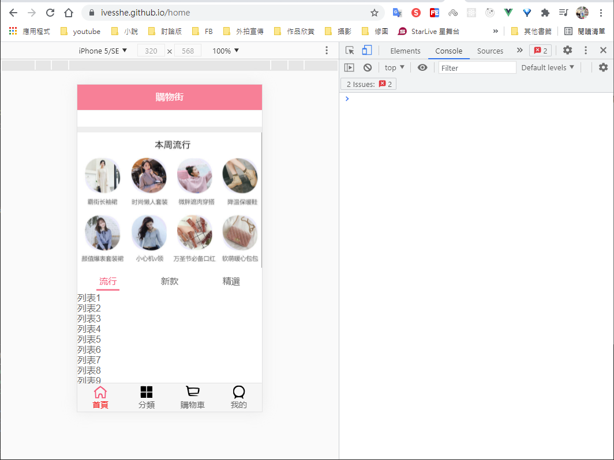
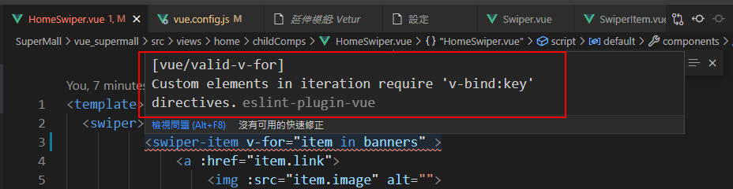
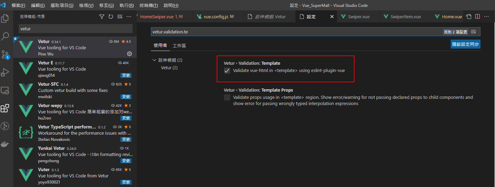
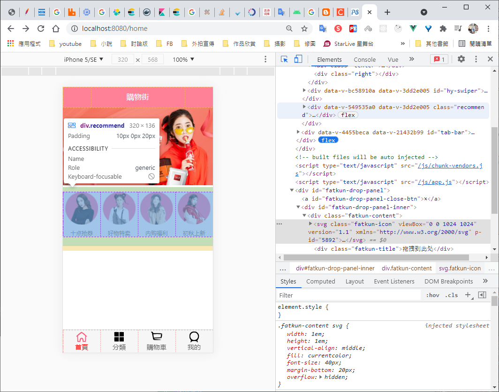
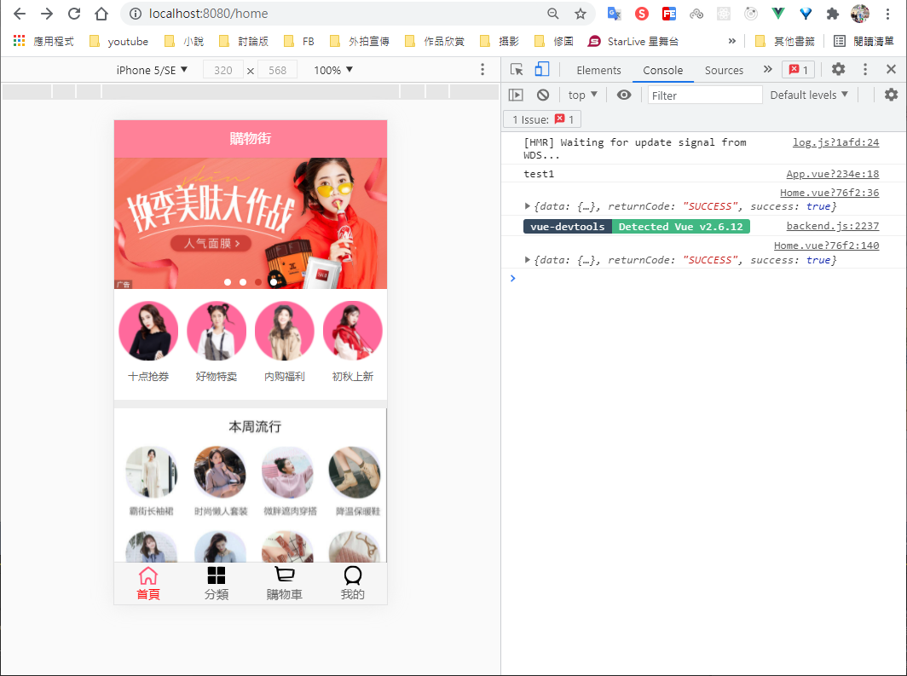
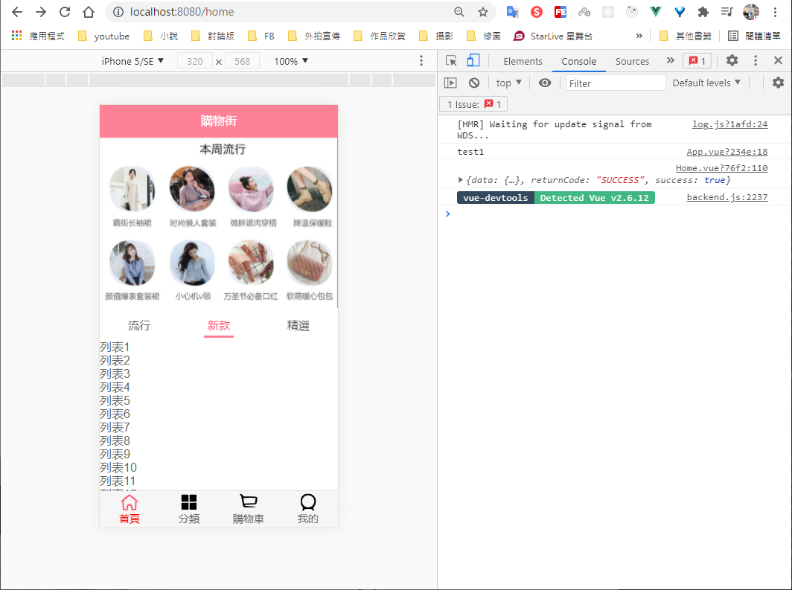

# Vue 電商 SuperMall

電商 購物網站建構

Github展示(開發中)


# 安裝vue腳手架

## Vue CLI

webpack全局安裝

```
npm i webpack -g
```

## 安裝Vue腳手架

```bash
npm i -g @vue/cli
```


# 創建項目

```bash
vue create supermall
```

上面安裝的是Vue CLI4的版本，如果想要按照Vue CLI2的方式初始化是不可以的，如果需要使用舊版本的vue init功能，需要全局安裝一個橋接工具

```bash
npm i -g @vue/cli-init
```


之後才能使用

```bash
vue init webpack myProject
```

## 創建項目

```bash
vue create vue_supermall
```


選擇自訂安裝


這邊其實是要拉掉Linter的預設安裝


選擇使用Vue2或Vue3


選擇package.json的方式


最後會詢問是否將這次的設定儲存，我選擇yes，存為ives_vue2這名稱


## 運行項目

```bash
cd vue_supermall
npm run serve
```

運行成功


# 安裝VSCode插件


# 安裝Chrome 擴充


方便開發


# 使用css初始化文件

https://github.com/necolas/normalize.css/

## 參考網址

https://cli.vuejs.org/zh/

https://cli.vuejs.org/zh/guide/installation.html

https://cli.vuejs.org/zh/guide/creating-a-project.html

# 建立資料夾結構


# 新建css

normalize.css

參考官網並下載

https://github.com/necolas/normalize.css/

base.css

```css
@import "./normalize.css";

/*:root -> 获取根元素html*/
:root {
  --color-text: #666;
  --color-high-text: #ff5777;
  --color-tint: #ff8198;
  --color-background: #fff;
  --font-size: 14px;
  --line-height: 1.5;
}

*,
*::before,
*::after {
  margin: 0;
  padding: 0;
  box-sizing: border-box;
}

body {
  font-family: "Helvetica Neue",Helvetica,"PingFang SC","Hiragino Sans GB","Microsoft YaHei","微软雅黑",Arial,sans-serif;
  user-select: none; /* 禁止用户鼠标在页面上选中文字/图片等 */
  -webkit-tap-highlight-color: transparent; /* webkit是苹果浏览器引擎，tap点击，highlight背景高亮，color颜色，颜色用数值调节 */
  background: var(--color-background);
  color: var(--color-text);
  /* rem vw/vh */
  width: 100vw;
}

a {
  color: var(--color-text);
  text-decoration: none;
}


.clear-fix::after {
  clear: both;
  content: '';
  display: block;
  width: 0;
  height: 0;
  visibility: hidden;
}

.clear-fix {
  zoom: 1;
}

.left {
  float: left;
}

.right {
  float: right;
}


```

# 新建vue.config.js

```js
module.exports = {
    configureWebpack: {
        resolve: {
            alias: {
                'assets': '@/assets',
                'common': '@/common',
                'components': '@/components',
                'network': '@/network',
                'views': '@/views',
            }
        }
    }
}
```

# 新建.editorconfig

統一代碼風格

```
root = true

[*]
charset = utf-8
indent_style = space
indent_size = 2
end_of_line = lf
insert_final_newline = true
trim_trailing_whitespace = true

```

# 安裝router

```bash
npm i vue-router --save
```


# 安裝better-scroll

官網

https://better-scroll.github.io/docs/zh-CN/guide/


```bash
npm i better-scroll --save
```


# 安裝axios

```bash
npm install --save axios
```


# 更換預覽小圖


# 打包

```bash
npm run build
```


# 動態獲取路徑


```html
<link rel="icon" href="<%= BASE_URL %>favicon.ico">
```

# 首頁 - 新增導航
## Home.vue

```js
<template>
  <div id="home">
      <nav-bar class="home-nav"><div slot="center">購物街</div></nav-bar>
  </div>
</template>

<script>
import NavBar from 'components/common/navbar/NavBar'

export default {
    name: "Home",
    components: {
        NavBar
    }
}
</script>

<style scoped>
    .home-nav {
        background-color: var(--color-tint);
        color: #fff;
    }
</style>
```

## NavBar.vue

```js
<template>
  <div class="nav-bar">
      <div class="left"><slot name="left"></slot></div>
      <div class="center"><slot name="center"></slot></div>
      <div class="right"><slot name="right"></slot></div>
  </div>
</template>

<script>
export default {

}
</script>

<style>
    .nav-bar {
        display: flex;
        height: 44px;
        line-height: 44px;
        text-align: center;
        box-shadow: 0 1px 1px rgba(100,100,100,.1);
    }

    .left, .right {
        width: 60px;
        /* background-color: red; */
    }

    .center {
        flex: 1;
        /* background-color: blue; */
    }
</style>
```


# 首頁 - 新增輪播圖

組件建立完成時，請求數據

## 新增home.js

```js
import { request } from "./request";

export function getHomeMultidata(){
    return request({
        url: '/home/multidata'
    })
}
```

## 修改Home.vue

```js
import {getHomeMultidata} from "network/home"

export default {
    name: "Home",
    components: {
        NavBar
    },
    data(){
        return {
            // result: null,
            banners: [],
            recommends: []
        }
    },
    created() {
        // 1.請求多個數據
        getHomeMultidata().then(res => {
            console.log(res);
            // this.result = res;
            // console.log("@@@result",this.result);
            this.banners = res.data.banner.list;
            this.recommends = res.data.recommend.list;
        })
    },
}
```

訪問得到的資料，已存放在data


## 新增swiper

直接使用封裝好的swiper組件

## 新增HomeSwiper.vue

將使用輪播圖的代碼，再封裝成一個組件，給Home.vue使用

```js
<template>
  <swiper>
          <swiper-item v-for="item in banners" :key="item">
              <a :href="item.link">
                  
              </a>
          </swiper-item>
      </swiper>
</template>

<script>
import {Swiper, SwiperItem} from 'components/common/swiper'

export default {
    name: "HomeSwiper",
    props: {
        banners: {
            type: Array,
            default() {
                return []
            }
        }
    },
    components: {
        Swiper,
        SwiperItem
    },
}
</script>

<style>

</style>
```

## 修改Home.vue

```js
<template>
  <div id="home">
      <nav-bar class="home-nav"><div slot="center">購物街</div></nav-bar>
      <home-swiper :banners="banners"/>
  </div>
</template>

<script>
import NavBar from 'components/common/navbar/NavBar'
import HomeSwiper from './childComps/HomeSwiper'
import {getHomeMultidata} from "network/home"

export default {
    name: "Home",
    components: {
        NavBar,
        HomeSwiper
    },
```

## 成功運行輪播圖


# 關閉eslint

因為創專案時，預設使用到eslint

VSCode也裝了Vetur，會跳eslint的警告



需要分別關閉

關閉專案eslint的檢察

```json
module.exports = {
    lintOnSave:false //關閉eslint檢查
}
```

關閉Vetur eslint的檢查



# 首頁 - 新增 推薦信息

## 新增RecommendView.vue

```js
<template>
  <div class="recommend">
      <div v-for="item in recommends" class="recommend-item">
          <a :href="item.link">
              
              <div>{{item.title}}</div>
          </a>
      </div>
  </div>
</template>

<script>
export default {
    name: "RecommendView",
    props: {
        recommends: {
            type: Array,
            default() {
                return []
            }
        }
    }
}
</script>

<style scoped>
    .recommend {
        display: flex;
        text-align: center;
        font-size: 12px;

        padding: 10px 0 20px;
        border-bottom: 10px solid #eee;
    }

    .recommend-item {
        flex: 1
    }

    .recommend-item img {
        width: 70px;
        height: 70px;
        margin-bottom: 10px;
    }
</style>
```

## 修改Home.vue

```js
<template>
  <div id="home">
      <nav-bar class="home-nav"><div slot="center">購物街</div></nav-bar>
      <home-swiper :banners="banners"/>
      <recommend-view :recommends="recommends"/>
  </div>
</template>

<script>
import RecommendView from './childComps/RecommendView'


export default {
    components: {
        RecommendView
    },
</script>    
```

## 推薦信息 - 運行畫面



# 首頁 - 新增 本周流行

## 新增FeatureView.vue

```js
<template>
  <div class="feature">
      <a href="https://act.mogujie.com/zzlx67">
        
      </a>
  </div>
</template>

<script>
export default {
    name: "FeatureView"
}
</script>

<style scoped>
    .feature img {
        width: 100%;
    }
</style>
```

## 修改Home.vue

```js
<template>
  <div id="home">
      <nav-bar class="home-nav"><div slot="center">購物街</div></nav-bar>
      <home-swiper :banners="banners"/>
      <recommend-view :recommends="recommends"/>
      <feature-view/>

  </div>
</template>

<script>
import NavBar from 'components/common/navbar/NavBar'
import HomeSwiper from './childComps/HomeSwiper'
import RecommendView from './childComps/RecommendView'
import FeatureView from './childComps/FeatureView'

import {getHomeMultidata} from "network/home"

export default {
    name: "Home",
    components: {
        NavBar,
        HomeSwiper,
        RecommendView,
        FeatureView
    },
    data(){  
        return {
            // result: null,
            banners: [],
            recommends: []
        }
    },
    created() {
        // 1.請求多個數據
        getHomeMultidata().then(res => {
            console.log(res);
            // this.result = res;
            // console.log("@@@result",this.result);
            this.banners = res.data.banner.list;
            this.recommends = res.data.recommend.list;
        })
    },
}
</script>

<style scoped>
    #home {
        /* 留標頭的空間 */
        padding-top: 44px;
    }

    .home-nav {
        background-color: var(--color-tint);
        color: #fff;

        /* 解決標頭一起滾動的問題 */
        position: fixed;    
        left: 0;
        right: 0;
        top: 0;
        z-index: 9;
    }
</style>
```


新增列表假資料，方便滑動

ul>li{列表$}*100

## 本週流行 - 運行畫面



# 首頁 - 新增 TabControl功能

## 新增TabControl.vue

```js
<template>
  <div class="tab-control">
      <div v-for="(item,index) in titles" 
      class="tab-control-item" 
      :class="{active: index===currentIndex}" 
      @click="itemClick(index)">
          <span>{{item}}</span>
      </div>
  </div>
</template>

<script>
export default {
    name: "TabControl",
    props: {
        titles: {
            type: Array,
            default() {
                return []
            }
        }
    },
    data() {
        return {
            currentIndex: 0
        }
    },
    methods: {
        itemClick(index) {
            this.currentIndex = index;
        }
    },
}
</script>

<style scoped>
    .tab-control {
        display: flex;
        text-align: center;
        font-size: 15px;
        
        height: 40px;
        line-height: 40px;
        background-color: #fff;
    }

    .tab-control-item {
        flex: 1;
    }

    .tab-control-item span {
        padding: 5px;
    }

    .active {
        color: var(--color-high-text);
    }

    .active span {
        border-bottom: 3px solid var(--color-tint);
    }
</style>
```

## 修改Home.vue

```js
<template>
  <div id="home">
        <tab-control class="tab-control" :titles="['流行','新款','精選']"/>
  </div>
</template>

<script>
import TabControl from 'components/content/tabControl/TabControl.vue'

export default {
    name: "Home",
    components: {
        TabControl
    },
```

## TabControl功能 - 運行畫面



# 將TabControl置頂


Home.vue
```js
<template>
  <div id="home">
      <tab-control class="tab-control" :titles="['流行','新款','精選']"/>
  </div>
</template>

<script>

</script>

<style scoped>

    /* 鎖定TabControl的位置 */
    .tab-control {
        position: sticky;
        top: 44px;
    }
</style>
```

設定好之後Tab即會固定在上方固定的位置，當y值到上方44px時，即不受滾動影響

# 打包上Github Pages

需修改vue.config.js的設定

新增這項設定

```js
module.exports = {
    publicPath: process.env.NODE_ENV === 'production'
    ? '/Vue_SuperMall/'
    : '/'

}
```

Vue_SuperMall為github專案名稱
